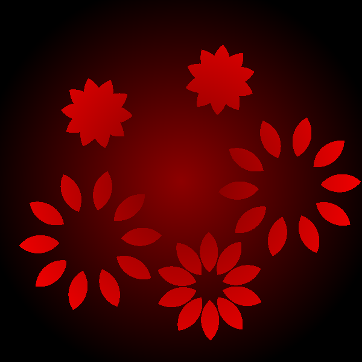

# petals

A neat little animation based on additive shape construction.

Requires [Futhark](http://futhark-lang.org) and SDL2 and SDL2-ttf
libraries with associated header files.

## Building and running

First run `futhark pkg sync` once.

Then run `make && ./petals -R -w 600 -h 600` to build and run in a
window.

Starts with a random shape.  Press:

  - Left arrow and right arrow to cycle the shapes
  - R to reset the time and the random number generator for all shapes

